# 🗳️ Votai — AI Election Navigator

# 🚀 Overview

Votai is an AI-powered civic guidance platform designed to help first-time and confused voters navigate the election process with clarity and confidence.

It transforms:

“I don’t understand elections”

into

“I know exactly what to do next.”

# 🎯 Problem Statement

Millions of voters struggle with:

❌ Understanding the voting process

❌ Knowing what steps to take (registration → verification → voting)

❌ Comparing parties objectively

❌ Accessing reliable, structured information

❌ Navigating government portals

# Existing solutions:

Static government websites

Scattered information

No personalization or guidance

# 💡 The Solution

Votai introduces a structured, AI-guided civic journey:

# 🧠 Dual-Layer Intelligence System

AI Explanation Layer (Gemini / Vertex AI)

→ Converts complex civic info into simple, structured guidance

Deterministic Fallback Engine

→ Keyword + weighted matching ensures system never fails

🔥 What Makes It Special

🎯 Step-by-step guided voter journey

🧠 AI-powered explanation engine

🛡️ Fully neutral (no bias, no recommendations)

⚡ Always works (AI + fallback system)

🌐 Integrated with real voter services

# 🏗️ Architecture

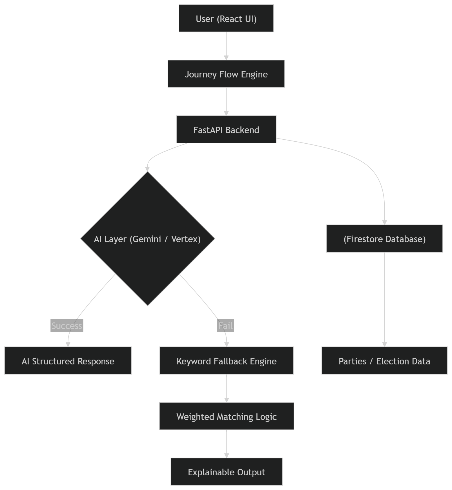

# ⚙️ Tech Stack

🖥️ Frontend: React.js + Vite

⚙️ Backend: FastAPI (Python)

🧠 AI: Google Vertex AI / Gemini

🗄️ Database: Firestore

☁️ Cloud: Google Cloud Run

🌐 Deployment: Vercel (frontend)

🔒 Security: CORS + controlled AI outputs

# ✨ Features

🧭 Guided Election Journey

→ Step-by-step flow from eligibility → voting

🤖 AI Election Assistant

→ Explains policies, process, and comparisons

📊 Party Comparison Engine

→ Focus areas, policies, past work (neutral)

🛠️ Smart Fallback System

→ If AI fails → keyword + weighted matching still answers

🔗 Real Government Integration

→ Direct links for:

voter registration

list verification

corrections

# ⚡ Resilient System Design

→ Never crashes, always responds

# 🧠 AI Design Philosophy

❌ No political bias

❌ No recommendations

❌ No ranking

✅ Neutral

✅ Structured

✅ Explainable

# 💻 How to Run Locally

1️⃣ Clone Repository

git clone https://github.com/your-username/votai.git

cd votai

2️⃣ Backend Setup

cd backend

pip install -r requirements.txt

Run server:

uvicorn main:app --reload

3️⃣ Frontend Setup

cd frontend

npm install

npm run dev

4️⃣ Environment Variables

Frontend (.env)

VITE_API_URL=http://localhost:8000

Backend (Cloud Run / local)

PROJECT_ID=your_project_id

REGION=us-central1

# ☁️ Deployment

Backend (Google Cloud Run)

gcloud run deploy votai-backend --source . --region us-central1 --allow-unauthenticated

Frontend (Vercel)

cd frontend

vercel --prod

# 🔮 Future Improvements

🗺️ Interactive election maps

📅 Personalized election reminders

🌍 Multi-language support

👤 User profiles & progress tracking

🧠 Smarter personalization using AI

# 🏁 Why Votai Stands Out

✔ Structured civic journey (not just chatbot)

✔ AI + deterministic fallback system

✔ Real-world usability (gov links)

✔ Neutral, safe, and explainable

✔ Production-ready deployment

# 🚀 Demo

Add your screenshots here:

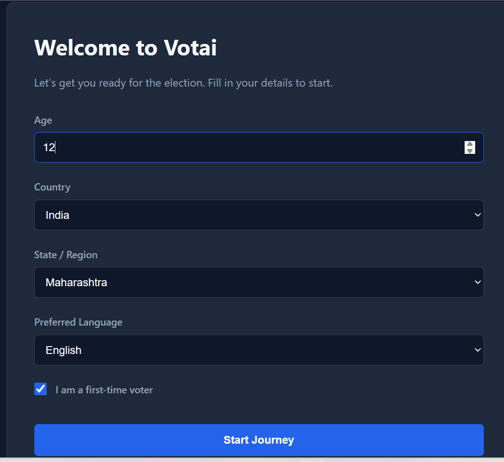

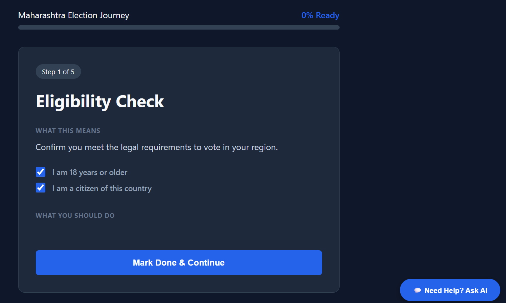
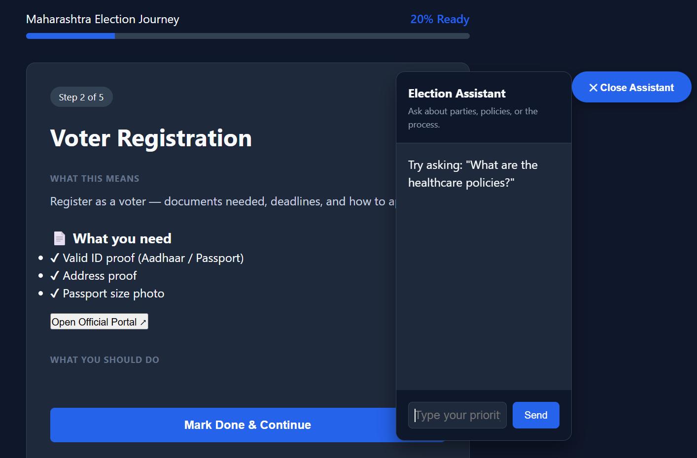
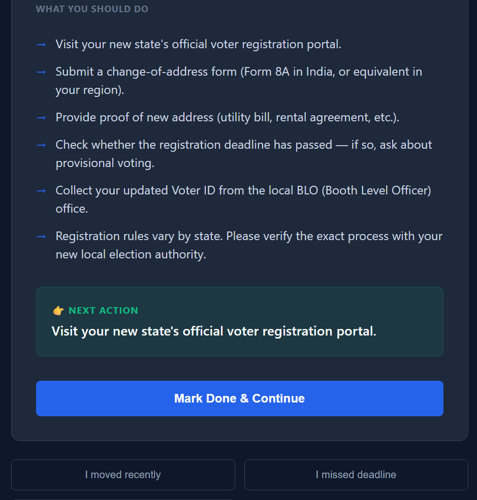
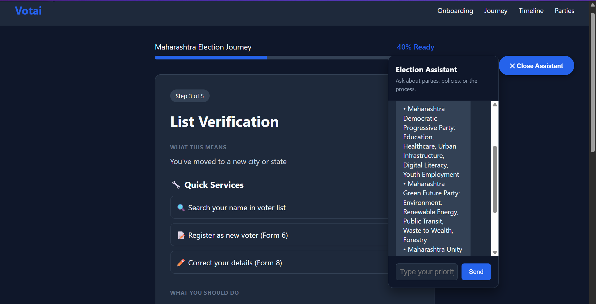
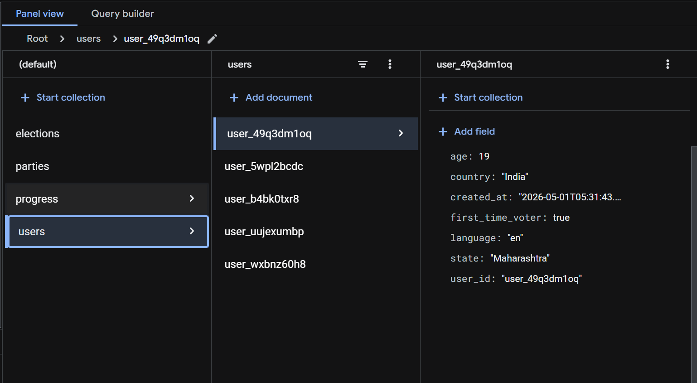
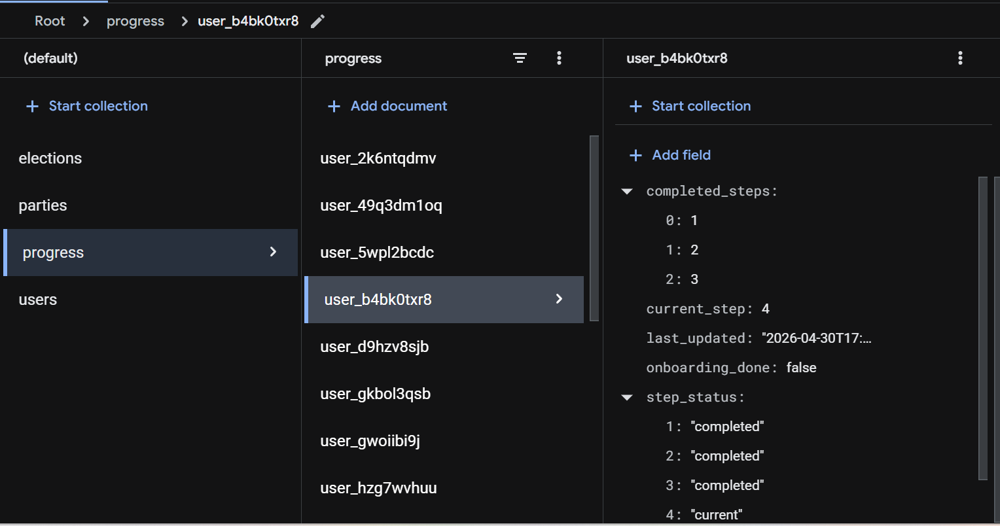
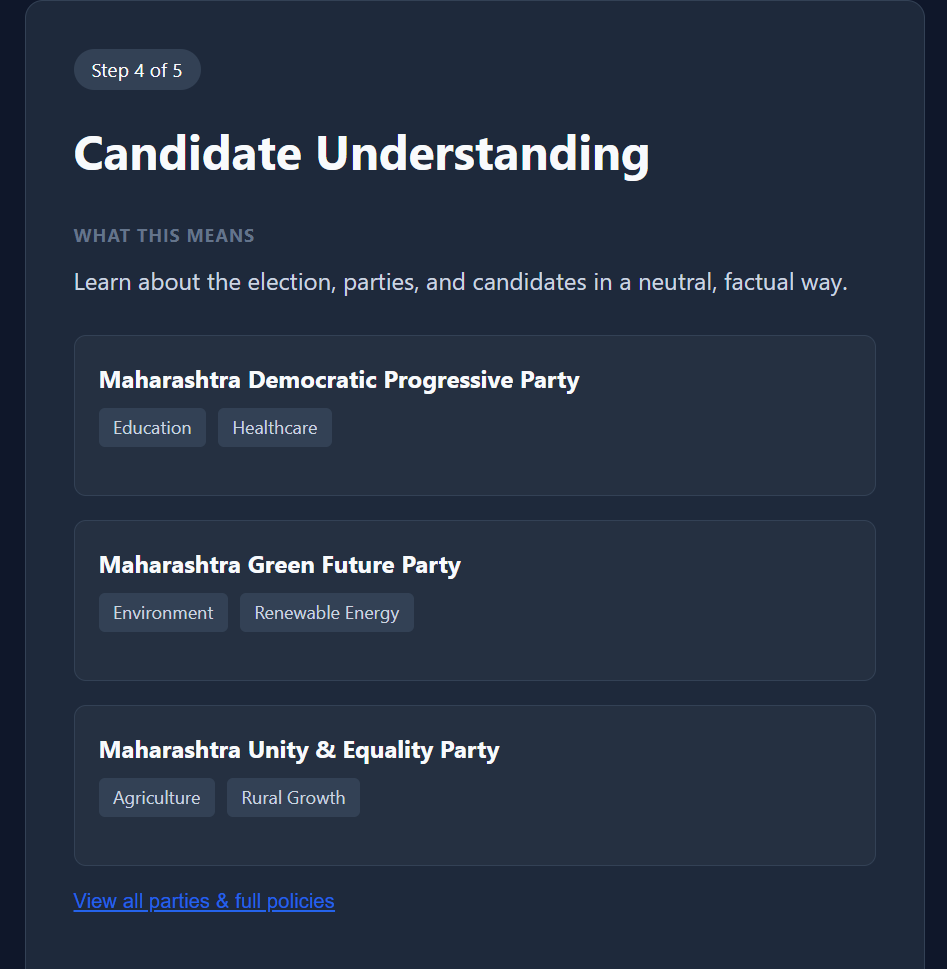
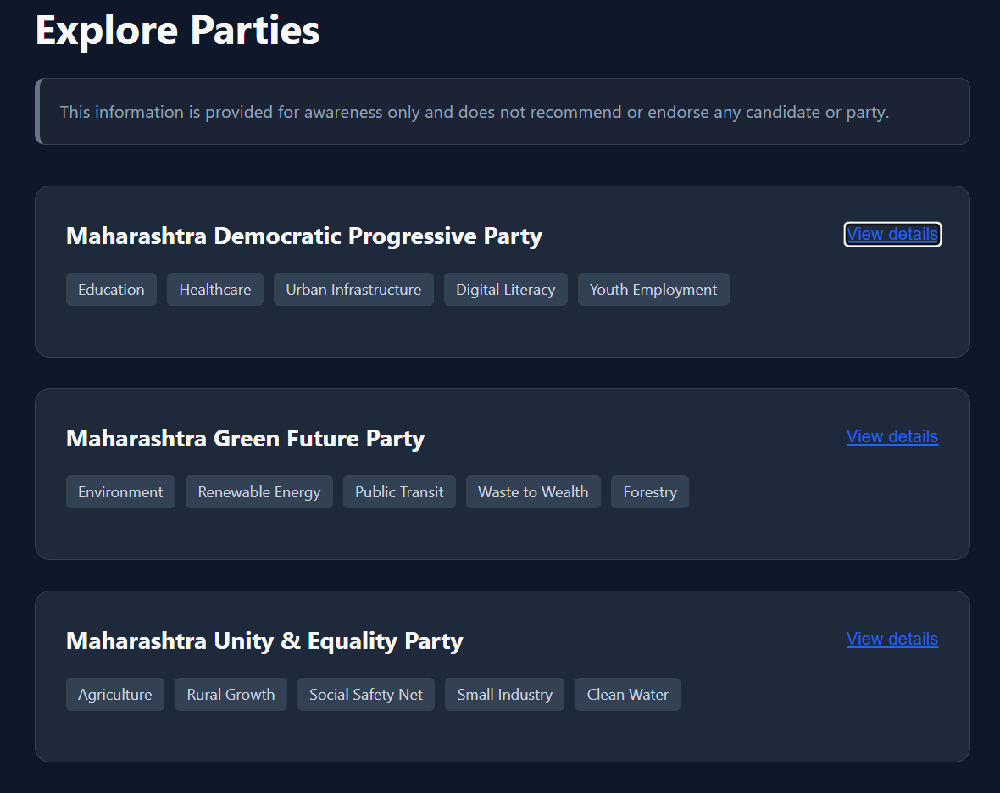
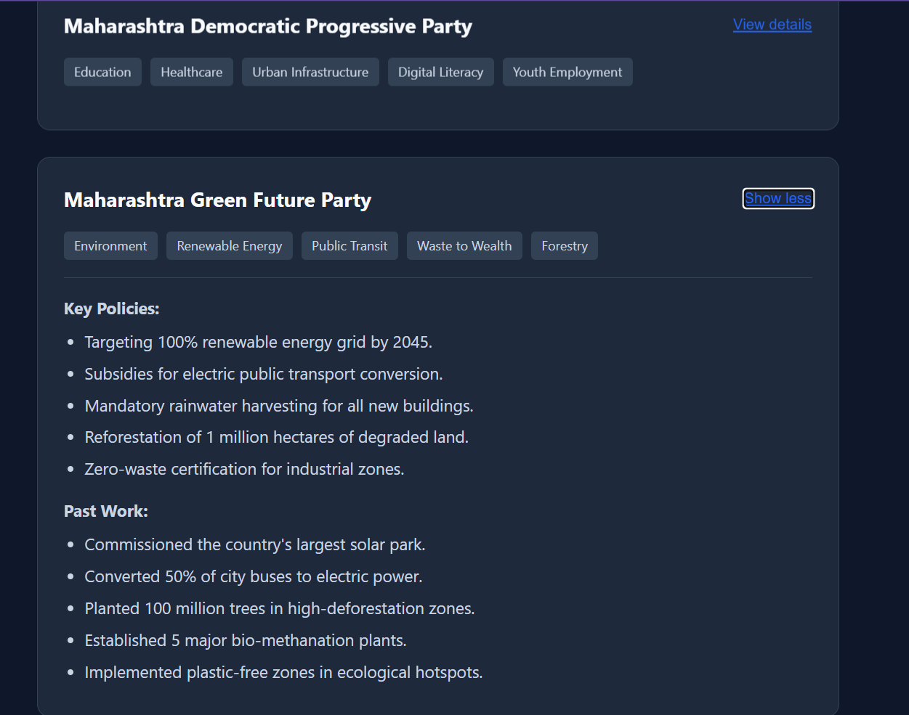
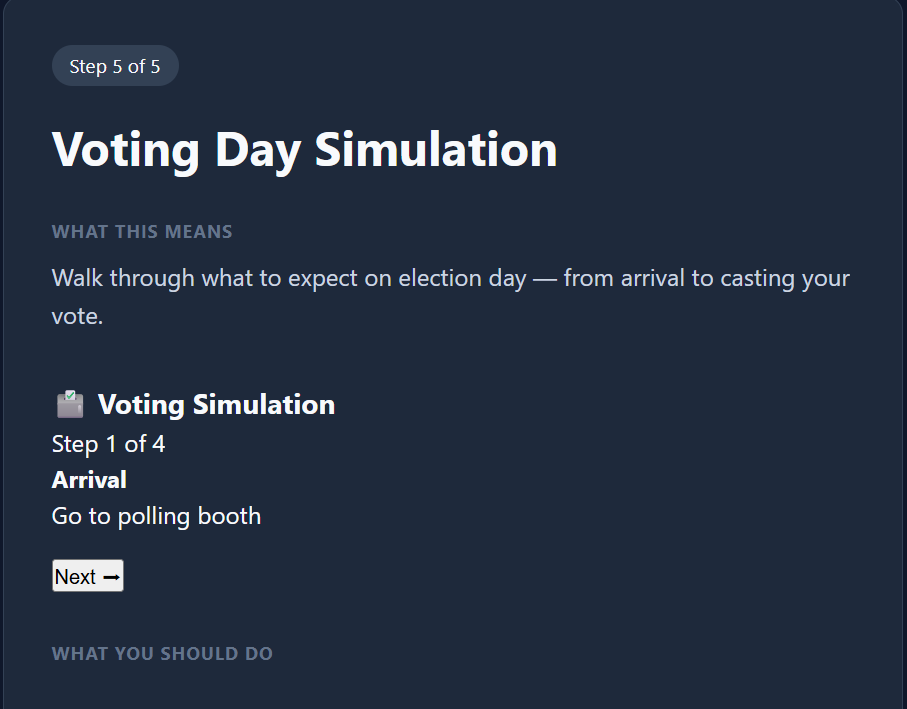
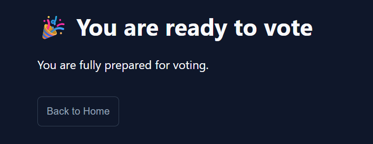
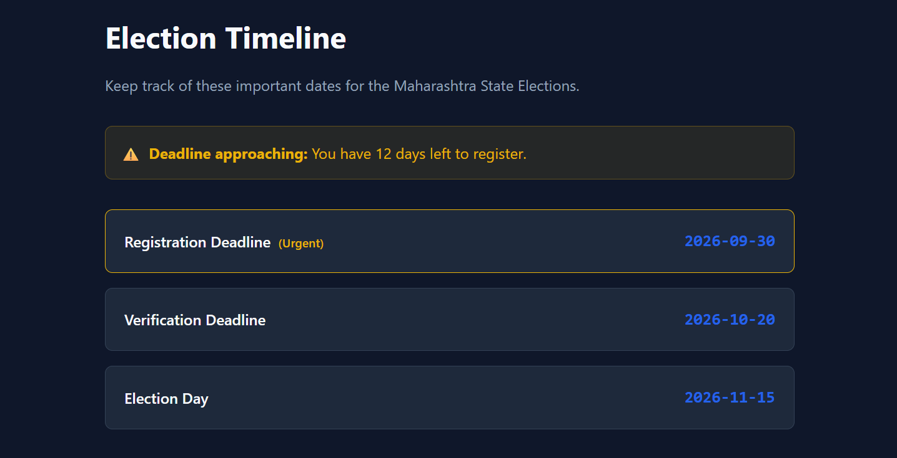

# 💬 Final Thought

“We are not changing how elections work.

We are making them understandable.”
